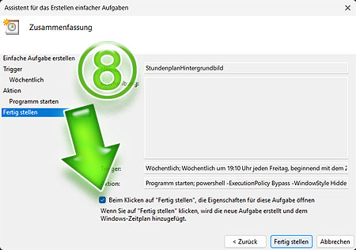
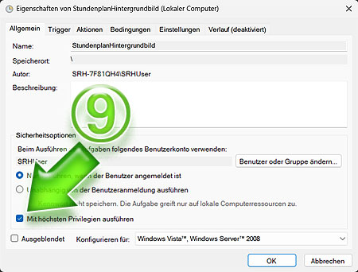

# Stundenplan als Hintergrundbild
Mit diesem ***Powershell-Skript*** `📄StundenplanHintergrundbildDunkel.ps1` 
kannst Du Deinen Stundenplan von ***DSBMobile*** als Deinen 
***Windows-Hintergrund*** festlegen
und über die ***Aufgabenplanung*** 
(Systemprogramm unter Windows) automatisch jede Woche 
aktualisieren lassen. Lade Dir das ***Powershell-Skript*** 
[StundenplanHintergrundbildDunkel.ps1](StundenplanHintergrundbildDunkel.ps1) 
auf Deine Festplatte herunter und öffne es mit einem Text-Editor. 

## DSBMobile Webseite (anmelden)
Mit ***Google Chrome*** öffnest Du Deinen Stundenplan und drückst 
dann `STRG + SHIFT + I`, um die ***Entwicklertools*** zu öffnen.

## Zoom auf die Entwicklertools
Hier siehst Du in einer Übersicht, wo Du Schritt für Schritt klickst, 
um an die nötigen Daten zu kommen. Diese Daten gibst Du noch 
in dem ***Powershell-Skript*** ein, damit es Deinen individuellen 
Stundenplan lädt und nicht den meinen. Klicke dazu bitte auf den 
Tab `Sources` **①**.

Mit einem *Rechtsklick* auf `🗀 data` **②** öffnest Du das *Dropdown-Menü*. 
Dort wählst Du `Search in folder` aus.

Jetzt wird rechts unten eine Zeile `file:data/` angezeigt **③**:

`file:data/1e7d336d-41c7-4a32-9b08-dde7ad6df345/f440c721-c59b-4a39-8b0a-958ee4215a59`

Diese beiden Ordner haben lange *Ziffern-Buchstaben-Kombinationen*, 
die Du am besten per *Copy & Paste* in **Zeile 9** des 
***Powershell-Skripts*** einfügst:

> Meine *Ziffern-Buchstaben-Kombination* ist folgende, Du hast 
> wahrscheinlich etwas anderes in den Entwicklertools angezeigt. 
> 

Den zweiten Teil der Daten zum Vervollständigen der **Zeile 9** im 
***Powershell-Skript*** findest Du unter `🗀 frame` **④**. 
In meinem Fall ist das `c00006.htm`.

##  Aufgabenplanung

So fügst Du Dein ***Powershell-Skript*** der ***Aufgabenplanung*** hinzu: 
Suche in Windows nach ***Aufgabenplanung*** **⑤** und starte sie.

Klicke dann auf `Einfache Aufgabe erstellen` **⑥**.

Trage in der **Eingabemaske** **⑦** bitte Folgendes ein:

* `Name`: *StundenplanHintergrundbild*
* `Trigger`: Auf `Wöchentlich` setzen
* `Freitag` um `11:00 Uhr` bietet sich an
* `Aktion`: Auf `Programm starten` setzen
* `Programm/Skript`: *powershell* eintippen
> `Argument hinzufügen (optional)`: Trage hier Folgendes ein 
> `-ExecutionPolicy Bypass -WindowStyle Hidden -File "C:\Documents\StundenplanHintergrundbildDunkel.ps1"`
>> **Wichtig:** Hier muss der genaue Dateipfad eingetragen werden, 
>> unter dem Du Dein Powershell-Skript abgespeichert hast.

Jetzt musst Du noch zwei Haken setzen: Den ersten bei **⑧**.

Und den zweiten Haken setzt Du bei **⑨**.

Fertig eingerichtet!

> PS: Guck noch einmal in das Bild mit der **⑥**. 
> Im oberen, mittleren Fenster kannst Du mit einem 
> Rechtsklick auf *StundenplanHintergrundbild* 
> Deine erstellte Aufgabe auch per Hand starten.
