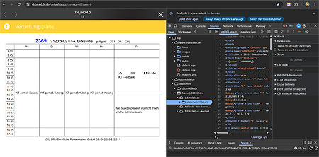
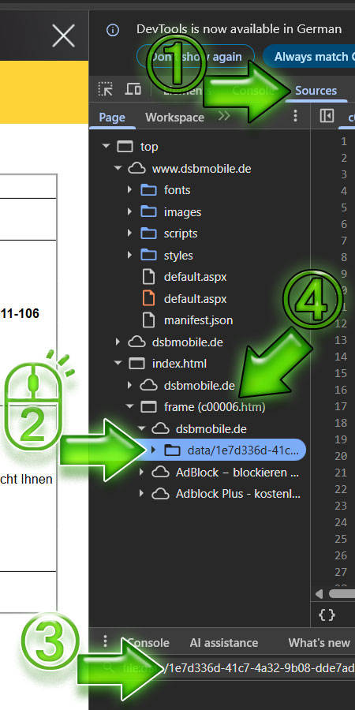
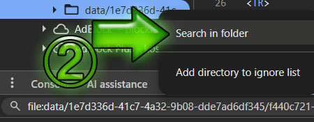
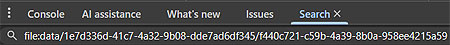
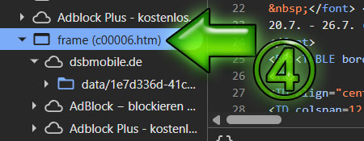
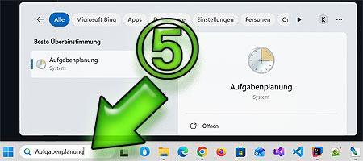
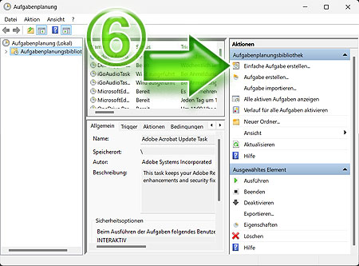
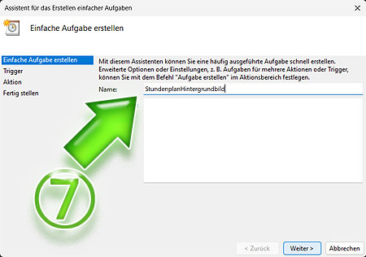

# Stundenplan als Hintergrundbild
Mit diesem ***Powershell-Skript*** [StundenplanHintergrundbildDunkel.ps1](StundenplanHintergrundbildDunkel.ps1) 
kannst Du Deinen Stundenplan von ***DSBMobile*** als Deinen 
***Windows Hintergrund*** festlegen
und über die ***Aufgabenplanung*** 
(Systemprogramm unter Windows) automatisch jede Woche 
aktualisieren lassen.

## DSBMobile Webseite (anmelden)
Mit ***Google Chrome*** öffnest Du Deinen Stundenplan und drückst 
dann `STRG + SHIFT + I`, um die ***Entwicklertools*** zu öffnen.

## Zoom auf die Entwicklertools
Hier siehst Du in einer Übersicht wo Du Schritt für Schritt klickst, 
um an die nötigen Daten zu kommen. Diese Daten gibst Du noch 
in dem ***Powershell-Skript*** ein, damit es Deinen individuellen 
Stundenplan läd und nicht den meinen. Klicke dazu bitte auf den 
Tab `Sources` **①**.

Mit *Rechtsklick* auf `🗀 data` **②**, um das *Drop Down Menü* zu 
öffnen. Dort `Search in folder` auswählen.

Jetzt wird rechts unten ein Zeile `file:data/` angezeigt **③**:

`file:data/1e7d336d-41c7-4a32-9b08-dde7ad6df345/f440c721-c59b-4a39-8b0a-958ee4215a59`

Diesese beiden Ordner haben lange *Ziffern-Buchstaben-Kom-* 
*binationen*, die Du am Besten mit *copy & paste* in **Zeile 9** des 
***Powershell-Skripts*** einfügst:

>Meine *Ziffern-Buchstaben-Kombination* ist folgende, Du hast 
>wahrscheinlich etwas anderes angezeigt in dem Entwicklertools. 
>

Den zweiten Teil der Daten zum Vervollständigen der **Zeile 9** im 
***Powershell-Skript*** findest Du unter `🗀 frame` **④**. 
In meinem Fall `c00006.htm`.

##  Aufgabenplanung

So fügst Du Dein ***Powershell-Skript*** der ***Aufgabenplanung*** hinzu:

